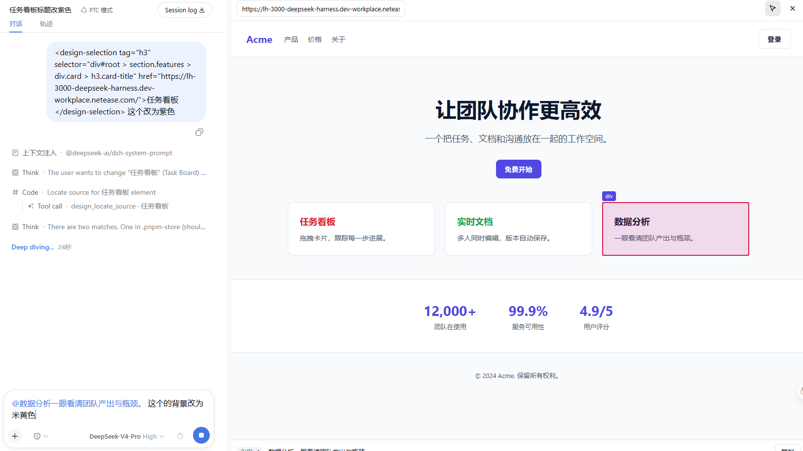

# dsh-design-plugin

DeepSeek Harness 的「设计模式」插件，从 [deepseek-harness](https://github.com/deepseek-ai/deepseek-harness) 抽取的独立仓库。

把聊天栏缩成左侧 25%、右侧 75% 的实时 iframe 预览；在预览里选中元素可生成「引用」，并调用 <code>design_locate_source</code> 工具把选区映射回工作区源码文件，让 agent 直接打开并修改对应文件。

本仓库含两个 npm 包：

| 包 | 作用 | 类型 |
| --- | --- | --- |
| [@dpsagent/dsh-design-plugin](packages/dsh-design-plugin) | 宿主：注册 <code>design_locate_source</code> 工具 + 设计模式提示词 | 组合包（带 <code>cordis.patch.yml</code>） |
| [@dpsagent/dsh-client-ui-design](packages/dsh-client-ui-design) | 浏览器端：侧栏开关、全屏 overlay、选区桥接、样式 | 客户端库 |

## 安装

前置条件：机器上已装好 DeepSeek Harness（<code>npx @deepseek-ai/dsh web</code>，或[从源码运行](https://github.com/deepseek-ai/deepseek-harness#run-from-source)）。本插件依赖 harness 自带的基础包（<code>@deepseek-ai/cordis</code>、<code>dsh-tools</code>、<code>dsh-system-prompt</code>、<code>dsh-invariants</code>、<code>dsh-client-*</code>），必须装进一个已有的 harness profile，不能脱离 harness 单独运行。

仓库已提交构建好的 <code>lib/</code>，安装时无需构建、也无需联网拉取额外依赖。

### 方式一：npm 安装（推荐，最简单）

~~~
dsh plugin --profile web add @dpsagent/dsh-design-plugin
dsh web
~~~

<code>@dpsagent/dsh-design-plugin</code> 会自动带上客户端库 <code>@dpsagent/dsh-client-ui-design</code>。

### 方式二：从 tarball 安装（未发布到 npm 时）

~~~
# 在仓库里打包两个包（分别产出 .tgz）
pnpm install
pnpm --filter @dpsagent/dsh-client-ui-design pack
pnpm --filter @dpsagent/dsh-design-plugin pack

# 把两个 .tgz 发给用户，用户在装有 harness 的机器上执行：
dsh plugin --profile web add ./dsh-client-ui-design-0.1.0-rc.8.tgz ./dsh-design-plugin-0.1.0-rc.8.tgz
dsh web
~~~

### 方式三：安装本地 checkout（开发用）

~~~
git clone https://github.com/agents-group/dsh-design-plugin.git
cd dsh-design-plugin
dsh plugin --profile web add ./packages/dsh-client-ui-design ./packages/dsh-design-plugin
dsh web
~~~

## 使用

1. 点击侧栏底部的「设计模式」进入：聊天栏缩到左侧 25%，右侧 75% 是 iframe 预览。
2. 在预览头部修改预览地址（默认 <code>http://localhost:3000</code>）。
3. 在预览里选中文本，点「捕获选中」：选区以「引用」卡片出现，可「复制」。
4. 在聊天里描述修改（例如「把这个按钮改成红色」），agent 用 <code>design_locate_source</code> 定位对应源码文件并修改。
5. 点「退出」回到普通界面。

## 目录结构

~~~
packages/dsh-design-plugin/      # 宿主组合包（工具 + 提示词 + cordis.patch.yml）
packages/dsh-client-ui-design/   # 浏览器端 UI 库
~~~

## 许可

[MIT](LICENSE)。本仓库是 deepseek-harness 中 design 插件的忠实抽取，版权归 DeepSeek 所有。
